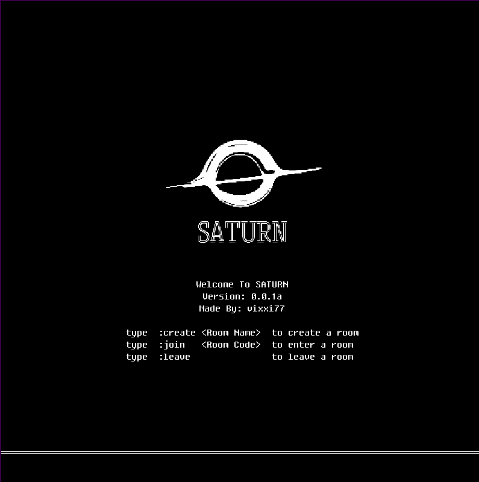
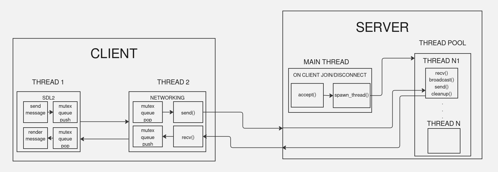

# POSIX C SOCKET CHAT APP

    

## HIGH-LEVEL ARCHITECTURE

- version 1 (naive client per thread)

    

- version 2 (polling blocking functions wiht epoll and nonblocking sockets)

## DEPENDENCIES
### CLIENT
- SDL2 (windowing & rendering)

## PLATFORM
- Both Server and Client are built and tested on Linux 
- Uses POSIX threads
- Uses POSIX sockets 

## CLIENT
- SDL2 Window
- C-Posix-Sockets
- Posix-pthreads

## SERVER
- C-Posix-Sockets
- Posix-pthreads
- Hosted on a VPS 

## SOURCES
- [Beej's Guide To Posix Sockets](https://beej.us/guide/bgnet/html/)
